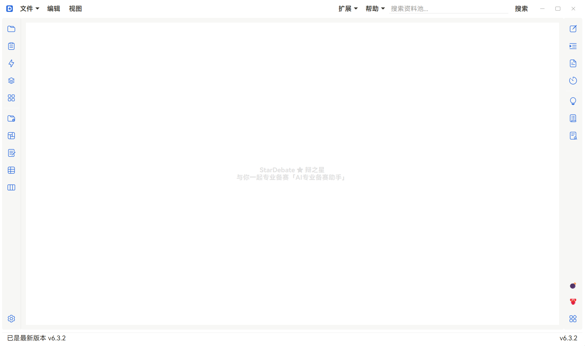

# StarDebate ★ 辩之星

> 🤖 基于 Vibe-Coding（AI 辅助编程）构建

[](https://www.python.org)
[](https://www.riverbankcomputing.com/software/pyqt/)
[](LICENSE)
[](https://deepseek.com)
[](#)
[](#)

> 一款基于 PyQt5 的辩论辅助与训练桌面应用，集成 AI 分析、模拟训练、资料管理等功能，覆盖辩论备赛全流程。

> 🌐 [English](README.md)



---

## ✨ 功能概览

| 功能 | 说明 |
|------|------|
| 🧠 **辩论框架** | 思维导图式的立论框架设计，支持正方/反方双视角 |
| 📝 **一辩稿编辑器** | 专业辩稿编辑界面，段落管理 + 词汇索引 |
| 🤖 **AI 写稿** | 接入 DeepSeek API，一键生成一辩稿初稿 |
| 📊 **AI 分析** | 对辩论材料进行深度分析，识别论证强弱项与逻辑漏洞 |
| ✍️ **AI 扩写** | 基于已有论点自动扩展论证内容 |
| ⚔️ **模拟质询 & 接质** | AI 驱动的模拟质询与接质训练，实时反馈 |
| 📚 **快速刷题** | 选择题模式刷题，即时评分与解析 |
| 🏋️ **立论驳论练习** | 结构化练习模板，AI 评分并提供改进建议 |
| 📋 **资料稿管理** | 集中管理辩论素材与参考文献 |
| 📑 **便签** | 浮动便签工具，随写随存 |
| 🏆 **赛程管理** | 自定义赛制编排、对阵管理、计时 |
| 🔐 **.stardebate 加密** | 双层加密文件格式（AES + 用户密码） |
| 🔄 **在线更新** | 基于 GitHub Releases 的自动检测与增量更新 |

---

## 🚀 快速开始

### 方式一：下载安装包（推荐）

从 [GitHub Releases](https://github.com/Chapin-Y/StarDebate/releases) 下载最新版 `StarDebate_vX.Y.Z_Setup.exe`，双击安装即可运行。

### 方式二：源码运行

```bash
# 1. 克隆仓库
git clone https://github.com/Chapin-Y/StarDebate.git
cd StarDebate

# 2. 安装依赖
pip install -r requirements.txt

# 3. 配置 API
#    将 config/config.example.json 复制为 config/config.json
#    将 config/api_config.example.json 复制为 config/api_config.json
#    在 api_config.json 中填入 DeepSeek API Key

# 4. 启动
python StarDebate.py
```

> **注意**：源码版与 EXE 版文件布局完全一致，源码运行前需自行安装 Python 3.10+。

---

## 🏗 项目结构

```
StarDebate/
├── StarDebate.py            # 启动器（LogService + QApplication + 软重启）
├── StarDebate_app.py        # 主应用窗口（管理器实例化 + Mixin 组合）
├── star_debate_log.py       # 独立日志进程
├── components/              # 通用 UI 组件
│   ├── title_bar/           # 自定义标题栏
│   ├── popup_dialog/        # 通用弹窗
│   ├── star_button/         # 自定义按钮
│   ├── star_checkbox/       # 自定义多选框
│   ├── svg_renderer/        # SVG 渲染器（主题跟随 + LRU 缓存）
│   ├── siui/                # PyQt-SiliconUI（内嵌修改版）
│   └── ...
├── workers/                 # 功能模块（按功能分文件夹）
│   ├── ai_analysis/         # AI 辩论分析
│   ├── ai_expand/           # AI 扩写
│   ├── speech_writer/       # AI 写稿
│   ├── cross_examination/   # 模拟质询 & 接质
│   ├── training/            # 模拟训练（刷题 + 立论驳论）
│   ├── framework/           # 辩论框架（思维导图）
│   ├── notes/               # 便签
│   ├── material_pool/       # 资料池
│   ├── tournament/          # 赛程管理
│   ├── nav_bar/             # 侧边导航栏
│   ├── top_nav/             # 顶部菜单栏
│   ├── settings/            # 设置系统（6 个子页面）
│   ├── updater/             # 本地 + GitHub 在线更新器
│   ├── plugin_manager/      # 插件系统核心
│   ├── extension_manager/   # 扩展包系统（v6.3.0）
│   ├── project_explorer/    # 项目树
│   ├── structure/           # 结构树
│   ├── speech_editor/       # 一辩稿编辑器
│   ├── ref_doc/             # 资料稿
│   ├── crash_monitor/       # 崩溃监控
│   ├── debug_console/       # 调试台
│   └── welcome_guide/       # 初次引导页
├── icon/                    # SVG 图标
├── style/                   # QSS 模板化主题系统
│   ├── qss_templates/       # @key@ 占位符模板（34 个）
│   └── themes/              # 主题定义（notion_dark / notion_light）
├── config/                  # 用户配置（gitignored，含出厂默认）
├── plugin_manager/          # 插件打包/安装工具
├── tools/                   # 构建与开发工具
├── docs/                    # 开发文档
└── custom_formats/          # 自定义赛制 JSON（用户数据，gitignored）
```

---

## 🧰 技术栈

| 层 | 技术 |
|----|------|
| GUI 框架 | PyQt5 |
| UI 组件库 | [PyQt-SiliconUI](https://github.com/ChinaIceF/PyQt-SiliconUI)（内嵌修改版） |
| AI 接口 | DeepSeek API（兼容 OpenAI 格式） |
| 文档解析 | pdfplumber, python-docx, openpyxl, beautifulsoup4 |
| 文件加密 | cryptography (Fernet / AES-256-GCM) |
| 网络请求 | PyQt5.QtNetwork (QNetworkAccessManager) |
| 主题系统 | QSS 模板 + theme.json |
| 打包工具 | PyInstaller + Inno Setup 6 |

---

## 📜 许可与致谢

本项目基于 **GNU General Public License v3 (GPL-3.0)** 发布。

### 致谢

- **PyQt-SiliconUI** — 本项目内嵌了 [PyQt-SiliconUI](https://github.com/ChinaIceF/PyQt-SiliconUI)（作者：ChinaIceF、rainzee wang）作为 UI 组件库，并在其基础上进行了修改和适配。该库同样基于 GPL-3.0 许可。
- **DeepSeek** — AI 分析功能调用 DeepSeek API。
- **Catppuccin** — 主题配色参考 [Catppuccin](https://github.com/catppuccin/catppuccin) 社区配色方案。
- **Vibe-Coding** — 本项目绝大部分代码由 AI 辅助生成，是人类与 AI 协作的实践产物。
